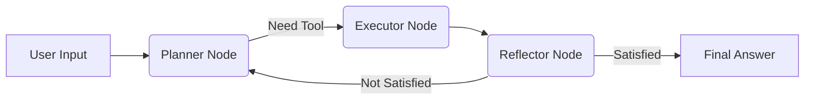

```markdown
# 🚀 Enterprise Agent Assistant

<p align="center">
  <b>基于 LangGraph 的企业级智能客服与数据分析 Agent</b>
  <br/>
  <i>Hybrid RAG + Multi-Tool Orchestration + Dynamic Visualization</i>
</p>

<p align="center">
  <a href="https://www.python.org/">
    
  </a>
  <a href="https://fastapi.tiangolo.com/">
    
  </a>
  <a href="https://www.langchain.com/">
    
  </a>
  <a href="https://github.com/langchain-ai/langgraph">
    
  </a>
</p>

---

## 📝 项目简介

这是一个面向企业场景的智能客服系统。它不仅是一个简单的 RAG（检索增强生成）问答机器人，更是一个具备**自主决策能力**的 Agent。系统能够根据用户意图，自动规划任务、调用工具（知识库检索、数据库查询、图表生成），并通过反思迭代优化结果。

**核心亮点：**
- 🧠 **Agent 架构**：基于 LangGraph 实现 `Plan -> Execute -> Reflect` 循环，具备记忆管理与反思迭代能力。
- 🔍 **Hybrid RAG**：`Vector (Embedding) + BM25` 双路召回 + `Rerank` 精排，解决单一检索的缺陷。
- 🛠️ **Tool Use**：支持动态工具调用，实现非结构化知识问答与结构化数据分析的融合。
- 📊 **动态可视化**：Agent 可根据分析结果自动生成 ECharts 图表配置，实现动态 UI 渲染。
- ☁️ **云原生落地**：集成阿里云百炼全家桶（LLM/Embedding/Rerank），无 GPU 依赖，轻量级部署。

---

## 📸 效果演示

<!-- 建议在此处添加项目截图 -->
<!--
<p align="center">
  
  
</p>
-->

| 功能 | 描述 |
| :--- | :--- |
| **智能问答** | 基于上传的企业文档回答问题，并标注引用来源。 |
| **数据分析** | 自动查询模拟数据库，回答业务指标类问题。 |
| **图表生成** | 根据数据自动生成可视化图表（柱状图、折线图等）。 |

---

## 🏗️ 系统架构

系统采用 **前后端分离** 架构，后端基于 LangGraph 状态机编排 Agent 流程。

### Agent 核心流程


### 技术栈
- **LLM & Embedding**: 阿里云百炼 (Qwen-Plus, Text-Embedding-V2, Gonxiang-Rerank)
- **Agent Framework**: LangGraph, LangChain
- **Backend**: FastAPI, ChromaDB, Rank-BM25
- **Frontend**: Streamlit, Streamlit-Echarts

---

## 🔥 核心功能

### 1. 混合检索 + 重排序
为了解决传统向量检索在“专有名词”上的短板，系统采用了混合检索策略：
- **向量检索**：利用百炼 Embedding API，捕捉语义相似性。
- **BM25检索**：基于关键词匹配，精准定位专有名词。
- **RRF 融合**：使用倒数排名融合算法合并两路结果。
- **Rerank**：调用云端 Rerank API 对结果进行精排，提升 Top-K 准确率。

### 2. Agent 工具生态
Agent 可根据语境动态选择工具：
- `knowledge_search`: 检索企业知识库（PDF/TXT/DOCX）。
- `database_query`: 查询业务数据（模拟 SQL 查询）。
- `generate_chart`: 生成 ECharts 可视化配置。

### 3. 上下文记忆
利用 LangGraph 的 `MemorySaver` 和 `add_messages` Reducer，实现了多轮对话的上下文保持，Agent 能“记住”之前聊过的内容。

---

## 🚀 快速开始

### 1. 环境准备
- Python 3.10+
- 阿里云百炼 API Key ([获取地址](https://bailian.console.aliyun.com/))

### 2. 安装依赖
建议使用虚拟环境：
```bash
python -m venv venv
source venv/bin/activate  # Linux/Mac
# venv\Scripts\activate   # Windows

pip install -r requirements.txt
```

### 3. 配置环境变量
在项目根目录创建 `.env` 文件：
```properties
# 阿里云百炼 API Key
DASHSCOPE_API_KEY=sk-xxxxxxxxxxxxxxxxxxxxx

# 模型配置 (默认值通常无需修改)
LLM_MODEL_NAME=qwen-plus
EMBEDDING_MODEL=text-embedding-v2
RERANKER_MODEL=gonxiang-rerank
```

### 4. 启动服务

**启动后端：**
```bash
python main.py
```
后端服务将运行在 `http://localhost:8000`。

**启动前端：**
打开新终端窗口：
```bash
streamlit run frontend/app.py
```
浏览器会自动弹出界面。

---

## 📂 项目结构

```text
enterprise_agent_assistant/
├── backend/
│   ├── agents/               # Agent 核心逻辑
│   │   ├── graph.py          # LangGraph 状态图定义
│   │   ├── state.py          # 状态定义
│   │   └── nodes/            # 节点实现 (规划/执行/反思)
│   ├── tools/                # 工具库
│   │   ├── rag_tool.py       # RAG 混合检索实现
│   │   ├── chart_tool.py     # 图表生成工具
│   │   └── db_tool.py        # 数据库查询工具
│   ├── core/                 # 核心配置与 Prompt
│   └── api/                  # FastAPI 路由
├── frontend/                 # Streamlit 前端
├── main.py                   # 后端启动入口
├── requirements.txt          # 依赖清单
└── README.md
```

---

## 💡 遇到的挑战与解决方案

| 挑战 | 解决方案 |
| :--- | :--- |
| **模型依赖冲突** | 锁定 `transformers` 与 `FlagEmbedding` 版本，解决 `is_torch_fx_available` 报错。 |
| **向量维度不匹配** | 切换 Embedding 模型时重建 ChromaDB 索引，解决 `InvalidDimensionException`。 |
| **API 批量限制** | 针对百炼 Embedding API 的 Batch Size 限制 (25条/次)，实现自动分片处理。 |
| **本地模型下载慢** | 放弃本地 Rerank 模型，全面转向阿里云百炼云端 API，实现全链路云端化。 |

---

## 🛣️ 未来规划

- [ ] 引入流式输出 (Streaming Response)，提升首字响应速度。
- [ ] 接入真实数据库，实现更复杂的 Text-to-SQL 能力。
- [ ] 增加多模态文档解析能力 (扫描件/图片)。
- [ ] 使用 Redis/Mysql 持久化对话历史与 Agent 状态。

---

## 📄 License

MIT License
```
